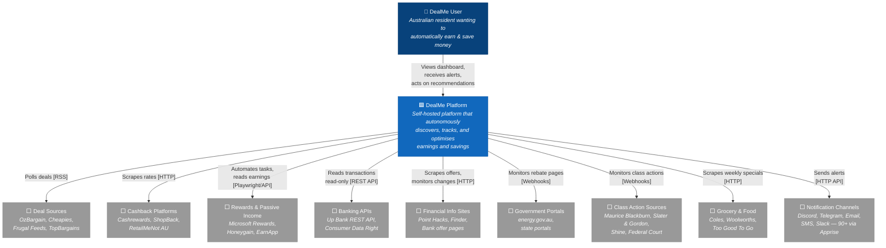
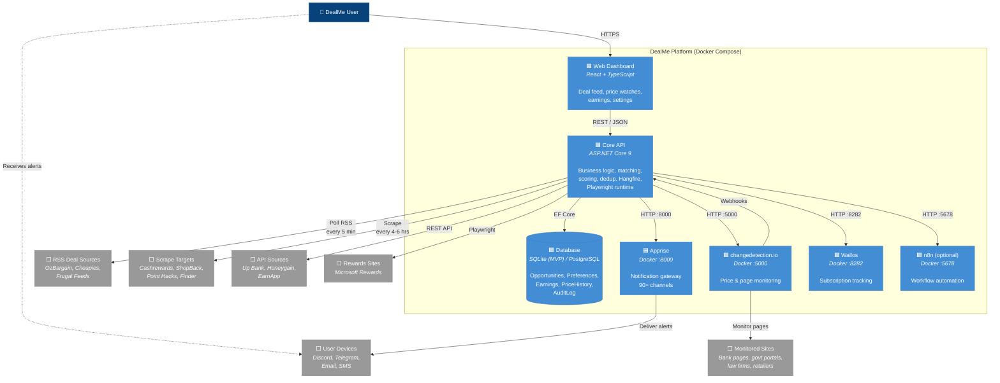
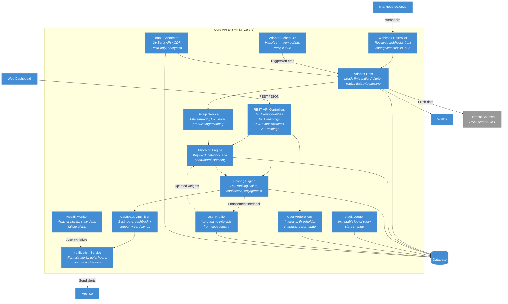
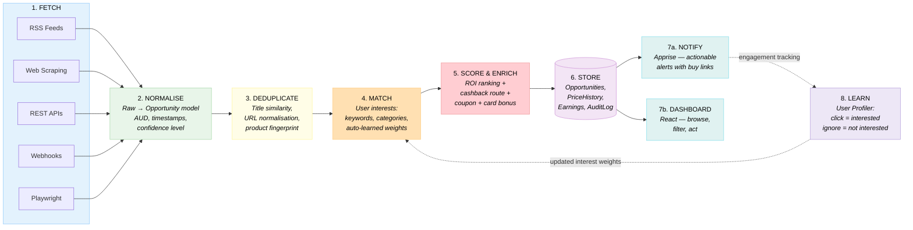
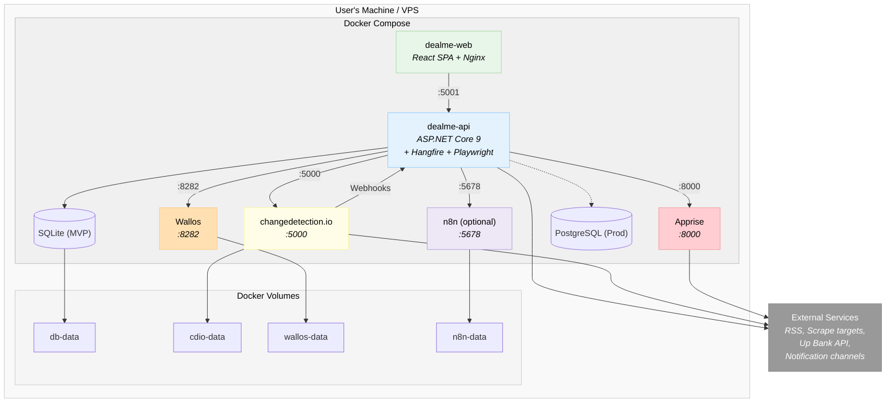

# DealMe - Architecture Diagrams (C4 Model)

> Rendered natively in VS Code (Ctrl+Shift+V) and on GitHub.

---

## C4 Level 1: System Context

Who uses DealMe and what external systems does it talk to?


```

**Legend:** 🟦 Blue = DealMe system | ⬜ Grey = External system

---

## C4 Level 2: Container Diagram

What Docker containers make up DealMe and how do they communicate?



**Legend:** 🟦 Blue = DealMe container | ⬜ Grey = External system

---

## C4 Level 3: Core API Components

What services live inside the Core API?



**Legend:** Light blue = Component | Blue = Container | Grey = External

---

## C4 Level 3: Adapter Layer

All 18 adapters implementing `IIntegrationAdapter`, grouped by deployment tier.

```mermaid
graph LR
    Host["Adapter Host<br/><i>Orchestrates all adapters</i>"]
    Interface["IIntegrationAdapter<br/><i>FetchAsync()<br/>NormaliseAsync()<br/>HealthCheckAsync()<br/>GetStatusAsync()</i>"]

    Host --> Interface

    subgraph Tier1["Tier 1: MVP"]
        OzBargain["OzBargain<br/><i>RSS — 5 min</i>"]
        Cheapies["Cheapies<br/><i>RSS — 5 min</i>"]
        FrugalFeeds["Frugal Feeds<br/><i>RSS — 15 min</i>"]
        CDIOa["changedetection.io<br/><i>Webhook — event</i>"]
        Apprisea["Apprise<br/><i>HTTP — on demand</i>"]
    end

    subgraph Tier2["Tier 2: Cashback & Bonuses"]
        Cashrewards["Cashrewards<br/><i>AngleSharp — 6 hrs</i>"]
        ShopBack["ShopBack<br/><i>AngleSharp — 6 hrs</i>"]
        PointHacks["Point Hacks<br/><i>RSS+Scrape — 12 hrs</i>"]
        Finder["Finder<br/><i>AngleSharp — 12 hrs</i>"]
        RetailMeNot["RetailMeNot AU<br/><i>AngleSharp — 12 hrs</i>"]
    end

    subgraph Tier3["Tier 3: Passive Income & Savings"]
        MSRewards["MS Rewards<br/><i>Playwright — daily 6am</i>"]
        Honeygain["Honeygain<br/><i>API — 24 hrs</i>"]
        EarnApp["EarnApp<br/><i>API — 24 hrs</i>"]
        UpBank["Up Bank<br/><i>REST API — 1 hr</i>"]
        GovRebate["Govt Rebates<br/><i>Static+Webhook — event</i>"]
        ClassAction["Class Actions<br/><i>Webhook — event</i>"]
        Grocery["Grocery<br/><i>AngleSharp — Wed 6pm</i>"]
        WallosA["Wallos<br/><i>Docker API — 24 hrs</i>"]
    end

    OzBargain --> Interface
    Cheapies --> Interface
    FrugalFeeds --> Interface
    CDIOa --> Interface
    Apprisea --> Interface

    Cashrewards --> Interface
    ShopBack --> Interface
    PointHacks --> Interface
    Finder --> Interface
    RetailMeNot --> Interface

    MSRewards --> Interface
    Honeygain --> Interface
    EarnApp --> Interface
    UpBank --> Interface
    GovRebate --> Interface
    ClassAction --> Interface
    Grocery --> Interface
    WallosA --> Interface

    style Host fill:#85BBF0,stroke:#78A8D8,color:#000
    style Interface fill:#85BBF0,stroke:#78A8D8,color:#000
    style Tier1 fill:#E3F2FD,stroke:#90CAF9,color:#000
    style Tier2 fill:#FFFDE7,stroke:#FFF59D,color:#000
    style Tier3 fill:#FCE4EC,stroke:#F8BBD0,color:#000
```



### Standard Output: Opportunity

Every adapter normalises its data into this model:

```
Opportunity
├── Id: guid
├── Source: string              ("ozbargain", "cashrewards", etc.)
├── Type: enum                  (Deal, Cashback, Bonus, Rebate, Earning)
├── Title: string
├── Description: string
├── Value: decimal (AUD)
├── Url: string
├── ExpiresAt: datetime?
├── Confidence: enum            (High, Medium, Low)
├── Tags: string[]
├── Metadata: Dictionary
└── CreatedAt: datetime
```

---

## Data Flow: Opportunity Pipeline

The 8-stage pipeline from source to user, with a feedback loop.



---

## Deployment: Docker Compose



### Ports Summary

| Container | Port | Protocol |
|---|---|---|
| dealme-api | 5001 | HTTP (REST API) |
| dealme-web | 80/443 | HTTP/S (Nginx) |
| changedetection.io | 5000 | HTTP (API + Webhooks) |
| Apprise | 8000 | HTTP (Notification API) |
| Wallos | 8282 | HTTP (Subscription API) |
| n8n | 5678 | HTTP (Workflow API) |
