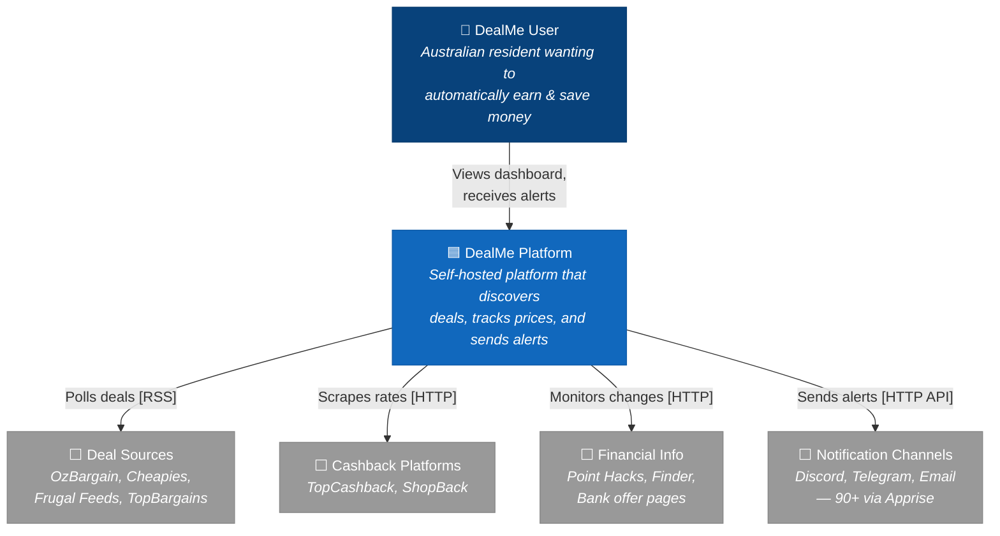
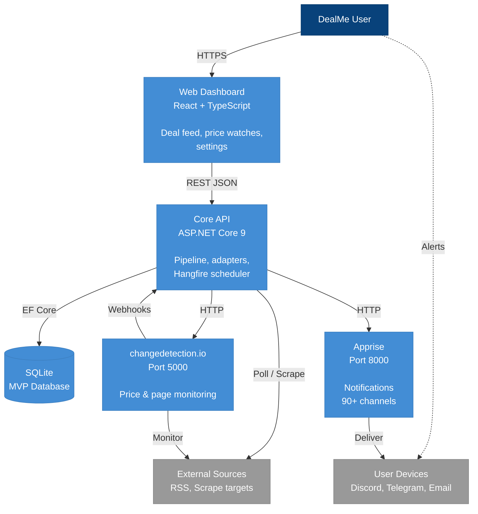
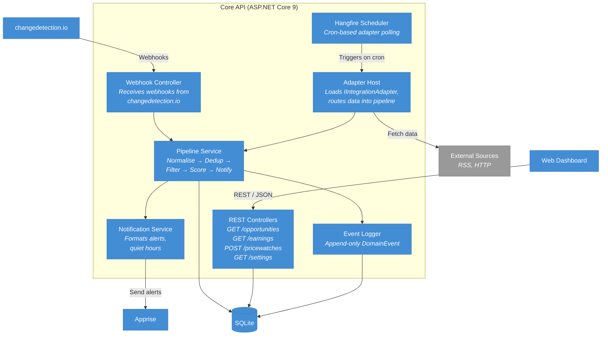
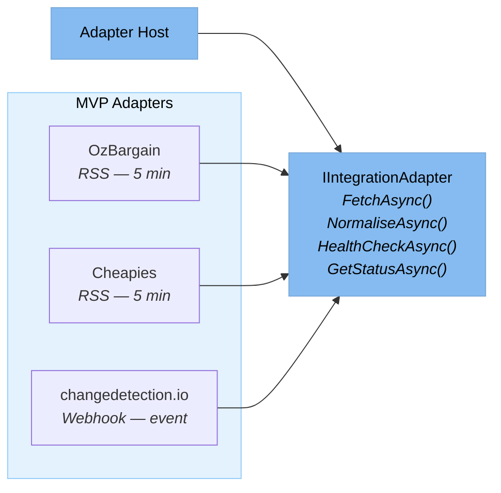
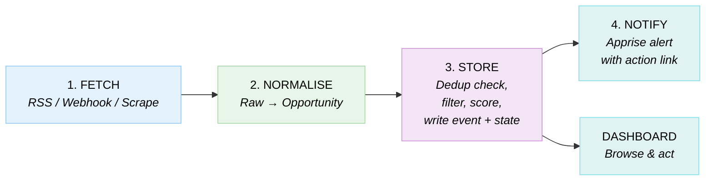
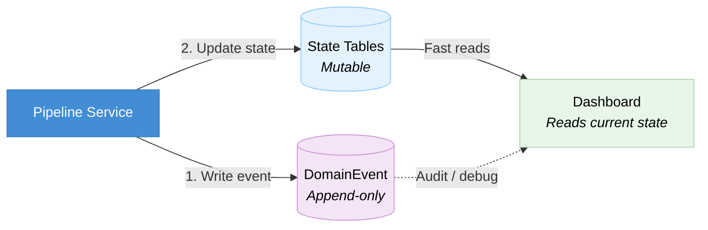
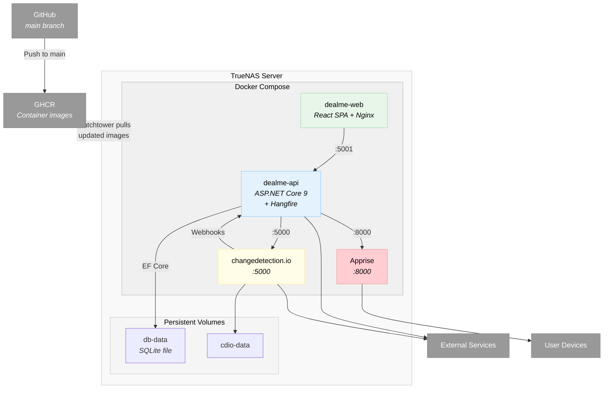

# DealMe - Architecture (C4 Model)

> Rendered natively in VS Code (Ctrl+Shift+V) and on GitHub.

---

## C4 Level 1: System Context



**Legend:** 🟦 Blue = DealMe system | ⬜ Grey = External system

**Future external systems** (Phase 2+): Banking APIs (Up Bank, CDR), Rewards & Passive Income (MS Rewards, Honeygain, EarnApp), Government Portals, Class Action Sources, Grocery & Food.

---

## C4 Level 2: Container Diagram



| Container | Port | Role |
|---|---|---|
| dealme-api | 5001 | ASP.NET Core 9 + Hangfire |
| dealme-web | 80/443 | React SPA + Nginx |
| changedetection.io | 5000 | Price/page monitoring |
| Apprise | 8000 | Notification gateway |

---

## C4 Level 3: Core API Components



**Pipeline Service** handles the full flow in a single service:
1. **Normalise** — raw data → `Opportunity` model (AUD, timestamps, confidence)
2. **Dedup** — check `Source + SourceId` unique constraint; skip if exists
3. **Filter** — match against user's enabled categories and min value threshold
4. **Score** — simple value + confidence ranking
5. **Notify** — send to Apprise if it passes the filter

---

## Adapter Layer

MVP adapters implementing `IIntegrationAdapter`:



### Future Adapters (Phase 2+)

| Tier | Adapters | Method |
|---|---|---|
| Cashback | TopCashback, ShopBack, RetailMeNot AU | AngleSharp scraping |
| Financial | Point Hacks, Finder | RSS + scraping |
| Passive Income | MS Rewards, Honeygain, EarnApp | Playwright / API |
| Banking | Up Bank, CDR | REST API |
| Government | Rebates, Class Actions | Webhooks |
| Grocery | Coles, Woolworths | AngleSharp scraping |

### Standard Output: Opportunity

Every adapter normalises its data into this model:

```
Opportunity
├── Id: guid
├── Source: string              ("ozbargain", "cheapies", etc.)
├── SourceId: string            (original ID from source)
├── Type: enum                  (Deal, Cashback, Bonus, Rebate, PriceAlert)
├── Status: enum                (New, Seen, Saved, ActedOn, Dismissed, Expired)
├── Title: string
├── Description: string
├── Value: decimal? (AUD)
├── Url: string
├── ExpiresAt: datetime?
├── Confidence: enum            (High, Medium, Low)
├── Tags: string[]
├── Metadata: Dictionary
├── CreatedAt: datetime
└── UpdatedAt: datetime
```

---

## Data Flow



---

## Event-Inspired Hybrid Pattern

Every pipeline run writes an append-only event **before** updating state. Events are never modified or deleted.



**Why keep events at MVP?** They're cheap (one append-only table), and give you: full audit trail, pipeline debugging via `CorrelationId`, and the option to add replay/learning later without schema changes.

---

## Deployment: Docker Compose on TrueNAS



### Auto-Deploy Flow

1. Push to `main` → GitHub Actions builds Docker images → pushes to GHCR
2. Watchtower (running on TrueNAS) polls GHCR for updated images
3. When new image detected → Watchtower pulls and restarts the container
4. Zero manual intervention, zero hardcoding

### Configuration

All config via `.env` file (never committed):

```env
# Database
DATABASE_PROVIDER=sqlite
CONNECTION_STRING=Data Source=/data/dealme.db

# Apprise
APPRISE_URL=http://apprise:8000

# changedetection.io
CDIO_URL=http://cdio:5000
CDIO_API_KEY=${CDIO_API_KEY}

# Notification defaults
DEFAULT_NOTIFICATION_CHANNEL=discord://webhook_id/webhook_token
MIN_DEAL_VALUE=5.00
TIMEZONE=Australia/Melbourne
```
