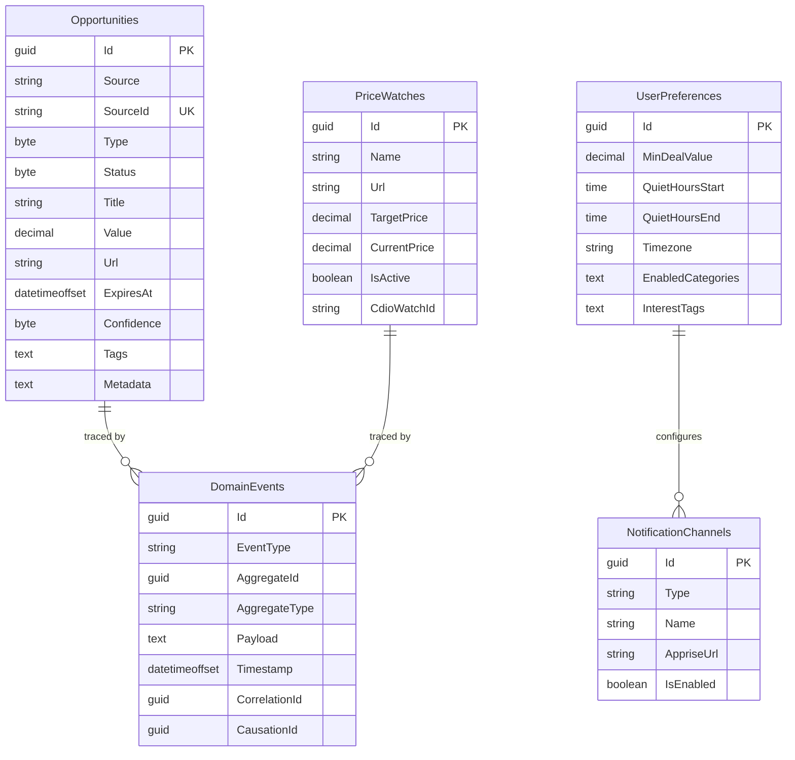

# DealMe - Database Schema

> **ORM:** Entity Framework Core 9
> **MVP:** SQLite | **Production:** PostgreSQL
> **Pattern:** Event-inspired hybrid (append-only event log + mutable state tables)

---

## Tables Overview

| Table | Type | Purpose |
|---|---|---|
| `DomainEvents` | Append-only | Audit trail, pipeline tracing, debug |
| `Opportunities` | Mutable | Current deal/offer state |
| `PriceWatches` | Mutable | User-created price alerts |
| `UserPreferences` | Mutable | Single-row config (single-user app) |
| `NotificationChannels` | Mutable | Configured notification targets |

---

## 1. DomainEvents (Append-Only)

Every pipeline run and user action writes here. Never modified or deleted.

| Column | Type | Nullable | Description |
|---|---|---|---|
| `Id` | `guid` | PK | |
| `EventType` | `varchar(100)` | NOT NULL | `OpportunityFetched`, `UserClicked`, `PriceChanged`, etc. |
| `AggregateId` | `guid` | NOT NULL | Entity this event relates to |
| `AggregateType` | `varchar(50)` | NOT NULL | `Opportunity`, `PriceWatch`, `Adapter` |
| `Payload` | `text` | NOT NULL | JSON event data |
| `Timestamp` | `datetimeoffset` | NOT NULL | UTC |
| `CorrelationId` | `guid` | NOT NULL | Traces one pipeline run end-to-end |
| `CausationId` | `guid` | NULL | Which event caused this one |

**Event types:** `OpportunityFetched`, `OpportunityStored`, `OpportunityNotified`, `OpportunityClicked`, `OpportunityDismissed`, `PriceChanged`, `PriceTargetMet`, `AdapterStarted`, `AdapterFailed`, `NotificationSent`

---

## 2. Opportunities

Current state of discovered deals and offers.

| Column | Type | Nullable | Description |
|---|---|---|---|
| `Id` | `guid` | PK | |
| `Source` | `varchar(50)` | NOT NULL | `ozbargain`, `cheapies`, etc. |
| `SourceId` | `varchar(255)` | NOT NULL | Original ID from source (RSS guid, URL hash) |
| `Type` | `tinyint` | NOT NULL | `OpportunityType` enum |
| `Status` | `tinyint` | NOT NULL | `OpportunityStatus` enum, default `New` |
| `Title` | `varchar(500)` | NOT NULL | |
| `Description` | `text` | NULL | |
| `Value` | `decimal(10,2)` | NULL | Estimated value in AUD |
| `Url` | `varchar(2048)` | NOT NULL | Direct link |
| `ImageUrl` | `varchar(2048)` | NULL | Thumbnail |
| `ExpiresAt` | `datetimeoffset` | NULL | |
| `Confidence` | `tinyint` | NOT NULL | `ConfidenceLevel` enum |
| `Tags` | `text` | NOT NULL | JSON array: `["electronics","gaming"]` |
| `Metadata` | `text` | NOT NULL | JSON object: source-specific data |
| `CreatedAt` | `datetimeoffset` | NOT NULL | |
| `UpdatedAt` | `datetimeoffset` | NOT NULL | |

**Unique constraint:** `Source + SourceId` (this is the dedup mechanism)

---

## 3. PriceWatches

User-created "alert me when price drops" powered by changedetection.io.

| Column | Type | Nullable | Description |
|---|---|---|---|
| `Id` | `guid` | PK | |
| `Name` | `varchar(200)` | NOT NULL | "PS5 at Amazon" |
| `Url` | `varchar(2048)` | NOT NULL | Page to monitor |
| `TargetPrice` | `decimal(10,2)` | NOT NULL | Alert at or below |
| `CurrentPrice` | `decimal(10,2)` | NULL | Last known price |
| `IsActive` | `boolean` | NOT NULL | Default `true` |
| `CdioWatchId` | `varchar(100)` | NULL | changedetection.io watch UUID |
| `LastCheckedAt` | `datetimeoffset` | NULL | |
| `CreatedAt` | `datetimeoffset` | NOT NULL | |
| `UpdatedAt` | `datetimeoffset` | NOT NULL | |

---

## 4. UserPreferences

Single row. Current config state — no history needed.

| Column | Type | Nullable | Description |
|---|---|---|---|
| `Id` | `guid` | PK | |
| `MinDealValue` | `decimal(10,2)` | NOT NULL | Default `5.00` |
| `QuietHoursStart` | `time` | NULL | e.g. `22:00` |
| `QuietHoursEnd` | `time` | NULL | e.g. `07:00` |
| `Timezone` | `varchar(50)` | NOT NULL | Default `Australia/Melbourne` |
| `EnabledCategories` | `text` | NOT NULL | JSON array of `OpportunityType` values |
| `InterestTags` | `text` | NOT NULL | JSON array: `["electronics","travel","groceries"]` |
| `CreatedAt` | `datetimeoffset` | NOT NULL | |
| `UpdatedAt` | `datetimeoffset` | NOT NULL | |

---

## 5. NotificationChannels

Configured Apprise notification targets.

| Column | Type | Nullable | Description |
|---|---|---|---|
| `Id` | `guid` | PK | |
| `Type` | `varchar(50)` | NOT NULL | `discord`, `telegram`, `email`, etc. |
| `Name` | `varchar(100)` | NOT NULL | "My Discord" |
| `AppriseUrl` | `varchar(500)` | NOT NULL | Apprise-format URL (encrypted at rest) |
| `IsEnabled` | `boolean` | NOT NULL | Default `true` |
| `CreatedAt` | `datetimeoffset` | NOT NULL | |
| `UpdatedAt` | `datetimeoffset` | NOT NULL | |

---

## Enums

```csharp
public enum OpportunityType : byte
{
    Deal = 0,
    Cashback = 1,
    Bonus = 2,
    Rebate = 3,
    PriceAlert = 4
}

public enum OpportunityStatus : byte
{
    New = 0,
    Seen = 1,
    Saved = 2,
    ActedOn = 3,
    Dismissed = 4,
    Expired = 5
}

public enum ConfidenceLevel : byte
{
    High = 0,
    Medium = 1,
    Low = 2
}
```

**Phase 2+ enums** (add when needed): `EarningType`, `EarningStatus`, `BankAccessTier`, `SyncStatus`

---

## Indexes

| Table | Index | Columns | Rationale |
|---|---|---|---|
| DomainEvents | `IX_Event_Aggregate` | `AggregateType, AggregateId, Timestamp` | Query events for an entity |
| DomainEvents | `IX_Event_Correlation` | `CorrelationId` | Trace a pipeline run |
| Opportunities | `IX_Opp_Source_SourceId` | `Source, SourceId` | **Unique** — dedup |
| Opportunities | `IX_Opp_Status_Created` | `Status, CreatedAt DESC` | Dashboard: new deals |
| Opportunities | `IX_Opp_ExpiresAt` | `ExpiresAt` | Expiration cleanup |
| PriceWatches | `IX_PW_Active` | `IsActive` | Active watch queries |

---

## Entity Relationship Diagram



---

## SQLite → PostgreSQL Migration

| Concern | SQLite (MVP) | PostgreSQL (Prod) |
|---|---|---|
| JSON columns | `text` + `json_extract()` | Native `jsonb` + GIN indexes |
| Timestamps | ISO 8601 text | Native `timestamptz` |
| Concurrent writes | WAL mode, single-writer | Full MVCC |

Switch via environment variable — no code changes:

```env
DATABASE_PROVIDER=sqlite
CONNECTION_STRING=Data Source=/data/dealme.db

# or

DATABASE_PROVIDER=postgresql
CONNECTION_STRING=Host=db;Database=dealme;Username=${DB_USER};Password=${DB_PASS}
```

EF Core handles provider differences transparently. Data migration: one-time script reads SQLite → writes PostgreSQL via EF Core.

---

## Phase 2+ Tables (Add When Needed)

| Table | When | Purpose |
|---|---|---|
| `Earnings` | Cashback/passive income adapters | Track pending/confirmed earnings |
| `AdapterConfigs` | More than 3 adapters | Runtime adapter configuration |
| `BankConnections` | Bank integration (Tier B+) | Encrypted API tokens, sync status |
| `InterestWeights` | Auto-learning feature | Computed engagement weights |
